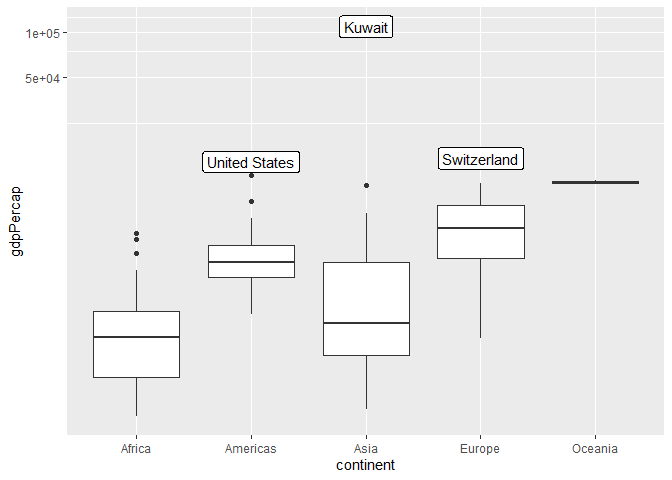

Gapminder
================
Kelly Brennan
2020-07-24

  - [Grading Rubric](#grading-rubric)
      - [Individual](#individual)
      - [Team](#team)
      - [Due Date](#due-date)
  - [Guided EDA](#guided-eda)
  - [Your Own EDA](#your-own-eda)

*Purpose*: Learning to do EDA well takes practice\! In this challenge
you’ll further practice EDA by first completing a guided exploration,
then by conducting your own investigation. This challenge will also give
you a chance to use the wide variety of visual tools we’ve been
learning.

<!-- include-rubric -->

# Grading Rubric

<!-- -------------------------------------------------- -->

Unlike exercises, **challenges will be graded**. The following rubrics
define how you will be graded, both on an individual and team basis.

## Individual

<!-- ------------------------- -->

| Category    | Unsatisfactory                                                                   | Satisfactory                                                               |
| ----------- | -------------------------------------------------------------------------------- | -------------------------------------------------------------------------- |
| Effort      | Some task **q**’s left unattempted                                               | All task **q**’s attempted                                                 |
| Observed    | Did not document observations                                                    | Documented observations based on analysis                                  |
| Supported   | Some observations not supported by analysis                                      | All observations supported by analysis (table, graph, etc.)                |
| Code Styled | Violations of the [style guide](https://style.tidyverse.org/) hinder readability | Code sufficiently close to the [style guide](https://style.tidyverse.org/) |

## Team

<!-- ------------------------- -->

| Category   | Unsatisfactory                                                                                   | Satisfactory                                       |
| ---------- | ------------------------------------------------------------------------------------------------ | -------------------------------------------------- |
| Documented | No team contributions to Wiki                                                                    | Team contributed to Wiki                           |
| Referenced | No team references in Wiki                                                                       | At least one reference in Wiki to member report(s) |
| Relevant   | References unrelated to assertion, or difficult to find related analysis based on reference text | Reference text clearly points to relevant analysis |

## Due Date

<!-- ------------------------- -->

All the deliverables stated in the rubrics above are due on the day of
the class discussion of that exercise. See the
[Syllabus](https://docs.google.com/document/d/1jJTh2DH8nVJd2eyMMoyNGroReo0BKcJrz1eONi3rPSc/edit?usp=sharing)
for more information.

``` r
library(tidyverse)
```

    ## -- Attaching packages --------------------------------------- tidyverse 1.3.0 --

    ## v ggplot2 3.3.2     v purrr   0.3.4
    ## v tibble  3.0.1     v dplyr   1.0.0
    ## v tidyr   1.1.0     v stringr 1.4.0
    ## v readr   1.3.1     v forcats 0.5.0

    ## -- Conflicts ------------------------------------------ tidyverse_conflicts() --
    ## x dplyr::filter() masks stats::filter()
    ## x dplyr::lag()    masks stats::lag()

``` r
library(gapminder)
```

*Background*: [Gapminder](https://www.gapminder.org/about-gapminder/) is
an independent organization that seeks to education people about the
state of the world. They promote a “fact-based worldview” by focusing on
data. The dataset we’ll study in this challenge is from Gapminder.

# Guided EDA

<!-- -------------------------------------------------- -->

First, we’ll go through a round of *guided EDA*. Try to pay attention to
the high-level process we’re going through—after this guided round
you’ll be responsible for doing another cycle of EDA on your own\!

**q0** Perform your “first checks” on the dataset. What variables are in
this dataset?

``` r
## TASK: Do your "first checks" here!
glimpse(gapminder)
```

    ## Rows: 1,704
    ## Columns: 6
    ## $ country   <fct> Afghanistan, Afghanistan, Afghanistan, Afghanistan, Afgha...
    ## $ continent <fct> Asia, Asia, Asia, Asia, Asia, Asia, Asia, Asia, Asia, Asi...
    ## $ year      <int> 1952, 1957, 1962, 1967, 1972, 1977, 1982, 1987, 1992, 199...
    ## $ lifeExp   <dbl> 28.801, 30.332, 31.997, 34.020, 36.088, 38.438, 39.854, 4...
    ## $ pop       <int> 8425333, 9240934, 10267083, 11537966, 13079460, 14880372,...
    ## $ gdpPercap <dbl> 779.4453, 820.8530, 853.1007, 836.1971, 739.9811, 786.113...

``` r
summary(gapminder)
```

    ##         country        continent        year         lifeExp     
    ##  Afghanistan:  12   Africa  :624   Min.   :1952   Min.   :23.60  
    ##  Albania    :  12   Americas:300   1st Qu.:1966   1st Qu.:48.20  
    ##  Algeria    :  12   Asia    :396   Median :1980   Median :60.71  
    ##  Angola     :  12   Europe  :360   Mean   :1980   Mean   :59.47  
    ##  Argentina  :  12   Oceania : 24   3rd Qu.:1993   3rd Qu.:70.85  
    ##  Australia  :  12                  Max.   :2007   Max.   :82.60  
    ##  (Other)    :1632                                                
    ##       pop              gdpPercap       
    ##  Min.   :6.001e+04   Min.   :   241.2  
    ##  1st Qu.:2.794e+06   1st Qu.:  1202.1  
    ##  Median :7.024e+06   Median :  3531.8  
    ##  Mean   :2.960e+07   Mean   :  7215.3  
    ##  3rd Qu.:1.959e+07   3rd Qu.:  9325.5  
    ##  Max.   :1.319e+09   Max.   :113523.1  
    ## 

**Observations**:

  - Write the variable names here

**q1** Determine the most and least recent years in the `gapminder`
dataset.

``` r
## TASK: Find the largest and smallest values of `year` in `gapminder`
year_max <- max(gapminder$year)
year_min <- min(gapminder$year)
```

Use the following test to check your work.

``` r
## NOTE: No need to change this
assertthat::assert_that(year_max %% 7 == 5)
```

    ## [1] TRUE

``` r
assertthat::assert_that(year_max %% 3 == 0)
```

    ## [1] TRUE

``` r
assertthat::assert_that(year_min %% 7 == 6)
```

    ## [1] TRUE

``` r
assertthat::assert_that(year_min %% 3 == 2)
```

    ## [1] TRUE

``` r
print("Nice!")
```

    ## [1] "Nice!"

**q2** Filter on years matching `year_min`, and make a plot of the GDE
per capita against continent. Choose an appropriate `geom_` to visualize
the data. What observations can you make?

You may encounter difficulties in visualizing these data; if so document
your challenges and attempt to produce the most informative visual you
can.

``` r
## TASK: Create a visual of gdpPercap vs continent
year1 <- filter(gapminder, year == year_min)

top_three <- top_n(year1, 3, gdpPercap)
  
ggplot(data = year1, mapping = aes(x = continent, y = gdpPercap)) + 
  geom_violin() +
  # geom_label(mapping = aes(label = country)) +
  coord_trans(y = "log") +
  geom_label(data= top_three, aes(label = country))
```

<!-- -->

**Observations**:

  - In 1952, Kuwait has the largest GDP by FAR.

**Difficulties & Approaches**:

  - When I first plotting the data point(), I could hardly see any
    differences between points, let alone distiinguish which countries
    were associated with the points.
  - I tried jitter to separate the points, and that worked well. I also
    decided to plot on a log scale to separate the points better.

**q3** You should have found at least three outliers in q2. Identify
those outliers (figure out which countries they are).

*Note*: I realize the reasons for

``` r
## TASK: Identify the outliers from q2
ggplot(data = year1, mapping = aes(x = continent, y = gdpPercap)) + 
  geom_boxplot() +
  # geom_label(mapping = aes(label = country)) +
  coord_trans(y = "log") + 
  geom_label(data = top_three, aes(label = country))
```

<!-- -->

**Observations**:

  - Identify the outlier countries from q2
  - Kuwait, because of oil?

**q4** Create a plot similar to yours from q2 studying both `year_min`
and `year_max`. Find a way to highlight the outliers from q3 on your
plot. Compare the patterns between `year_min` and `year_max`.

*Hint*: We’ve learned a lot of different ways to show multiple
variables; think about using different aesthetics or facets.

``` r
## TASK: Create a visual of gdpPercap vs continent
year2007 <- filter(gapminder, year == year_max)

top_three <- top_n(year2007, 3, gdpPercap)
  
ggplot(data = year2007, mapping = aes(x = continent, y = gdpPercap)) + 
  geom_boxplot() +
  # geom_label(mapping = aes(label = country)) +
  # coord_trans(y = "log") +
  geom_text(data= top_three, aes(label = country))
```

<!-- -->

**Observations**:

  - Write your observations here

# Your Own EDA

<!-- -------------------------------------------------- -->

Now it’s your turn\! We just went through guided EDA considering the GDP
per capita at two time points. You can continue looking at outliers,
consider different years, repeat the exercise with `lifeExp`, consider
the relationship between variables, or something else entirely.

**q5** Create *at least* three new figures below. With each figure, try
to pose new questions about the data.

``` r
## TASK: Your first graph

gapminder %>% 
  group_by(continent, year) %>% 
  summarize(meanContLE = mean(gdpPercap)) %>% 
  glimpse() %>% 
  ggplot(mapping = aes(x = year, y = meanContLE, color = continent)) +
  geom_point() +
  # ggplot(data = gapminder, aes(x = year, y = gdpPercap)) +
  # geom_line(color = continent)
  geom_smooth()
```

    ## `summarise()` regrouping output by 'continent' (override with `.groups` argument)

    ## Rows: 60
    ## Columns: 3
    ## Groups: continent [5]
    ## $ continent  <fct> Africa, Africa, Africa, Africa, Africa, Africa, Africa, ...
    ## $ year       <int> 1952, 1957, 1962, 1967, 1972, 1977, 1982, 1987, 1992, 19...
    ## $ meanContLE <dbl> 1252.572, 1385.236, 1598.079, 2050.364, 2339.616, 2585.9...

    ## `geom_smooth()` using method = 'loess' and formula 'y ~ x'

<!-- -->

``` r
## TASK: Your second graph
gapminder %>% 
  group_by(continent, year) %>% 
  summarize(meanContGdp = mean(lifeExp)) %>% 
  glimpse() %>% 
  ggplot(mapping = aes(x = year, y = meanContGdp, color = continent)) +
  geom_point() +
  # ggplot(data = gapminder, aes(x = year, y = gdpPercap)) +
  # geom_line(color = continent)
  geom_smooth()
```

    ## `summarise()` regrouping output by 'continent' (override with `.groups` argument)

    ## Rows: 60
    ## Columns: 3
    ## Groups: continent [5]
    ## $ continent   <fct> Africa, Africa, Africa, Africa, Africa, Africa, Africa,...
    ## $ year        <int> 1952, 1957, 1962, 1967, 1972, 1977, 1982, 1987, 1992, 1...
    ## $ meanContGdp <dbl> 39.13550, 41.26635, 43.31944, 45.33454, 47.45094, 49.58...

    ## `geom_smooth()` using method = 'loess' and formula 'y ~ x'

<!-- -->

``` r
# gapminder %>% 
#   ggplot() + 
#   geom_point(mapping = aes(x = year, y = gdpPercap)) +
#   facet_wrap(~ continent)
```

``` r
## TASK: Your third graph
gapminder %>% 
  group_by(continent, year) %>% 
  summarize(mean_cont_gdp = mean(gdpPercap), mean_cont_lifeexp = mean(lifeExp)) %>% 
  ggplot(mapping = aes(x = mean_cont_gdp, y = mean_cont_lifeexp, color = continent)) +
  geom_point() 
```

    ## `summarise()` regrouping output by 'continent' (override with `.groups` argument)

<!-- -->

``` r
  # ggplot(data = gapminder, aes(x = year, y = gdpPercap)) +
  # geom_line(color = continent)
  # geom_smooth()
```
