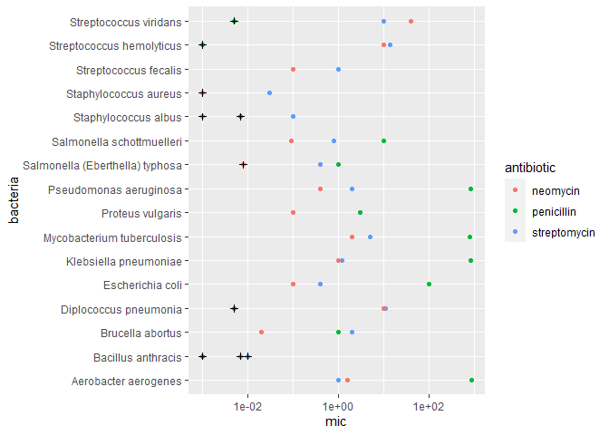
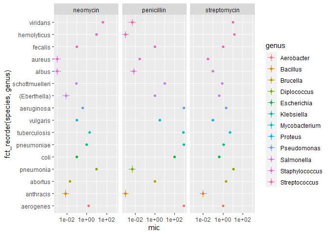
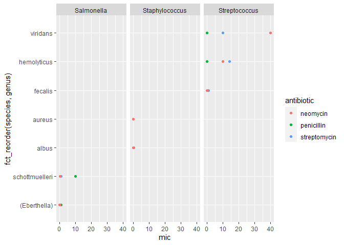

Antibiotics
================
Kelly Brennan
2020-07-28

  - [Grading Rubric](#grading-rubric)
      - [Individual](#individual)
      - [Team](#team)
      - [Due Date](#due-date)
  - [Visualization](#visualization)
      - [Purpose: Compare Effectiveness](#purpose-compare-effectiveness)
      - [Purpose: Categorize Bacteria](#purpose-categorize-bacteria)
  - [References](#references)

*Purpose*: To create an effective visualization, we need to keep our
*purpose* firmly in mind. There are many different ways to visualize
data, and the only way we can judge efficacy is with respect to our
purpose.

In this challenge you’ll visualize the same data in two different ways,
aimed at two different purposes.

*Note*: Please complete your initial visual design **alone**. Work on
both of your graphs alone, and save a version to your repo *before*
coming together with your team. This way you can all bring a diversity
of ideas to the table\!

<!-- include-rubric -->

# Grading Rubric

<!-- -------------------------------------------------- -->

Unlike exercises, **challenges will be graded**. The following rubrics
define how you will be graded, both on an individual and team basis.

## Individual

<!-- ------------------------- -->

| Category    | Unsatisfactory                                                                   | Satisfactory                                                               |
| ----------- | -------------------------------------------------------------------------------- | -------------------------------------------------------------------------- |
| Effort      | Some task **q**’s left unattempted                                               | All task **q**’s attempted                                                 |
| Observed    | Did not document observations                                                    | Documented observations based on analysis                                  |
| Supported   | Some observations not supported by analysis                                      | All observations supported by analysis (table, graph, etc.)                |
| Code Styled | Violations of the [style guide](https://style.tidyverse.org/) hinder readability | Code sufficiently close to the [style guide](https://style.tidyverse.org/) |

## Team

<!-- ------------------------- -->

| Category   | Unsatisfactory                                                                                   | Satisfactory                                       |
| ---------- | ------------------------------------------------------------------------------------------------ | -------------------------------------------------- |
| Documented | No team contributions to Wiki                                                                    | Team contributed to Wiki                           |
| Referenced | No team references in Wiki                                                                       | At least one reference in Wiki to member report(s) |
| Relevant   | References unrelated to assertion, or difficult to find related analysis based on reference text | Reference text clearly points to relevant analysis |

## Due Date

<!-- ------------------------- -->

All the deliverables stated in the rubrics above are due on the day of
the class discussion of that exercise. See the
[Syllabus](https://docs.google.com/document/d/1jJTh2DH8nVJd2eyMMoyNGroReo0BKcJrz1eONi3rPSc/edit?usp=sharing)
for more information.

``` r
library(tidyverse)
```

    ## -- Attaching packages --------------------------------------- tidyverse 1.3.0 --

    ## v ggplot2 3.3.2     v purrr   0.3.4
    ## v tibble  3.0.1     v dplyr   1.0.0
    ## v tidyr   1.1.0     v stringr 1.4.0
    ## v readr   1.3.1     v forcats 0.5.0

    ## -- Conflicts ------------------------------------------ tidyverse_conflicts() --
    ## x dplyr::filter() masks stats::filter()
    ## x dplyr::lag()    masks stats::lag()

``` r
library(ggrepel)
```

*Background*: The data\[1\] we study in this challenge report the
[*minimum inhibitory
concentration*](https://en.wikipedia.org/wiki/Minimum_inhibitory_concentration)
(MIC) of three drugs for different bacteria. The smaller the MIC for a
given drug and bacteria pair, the more practical the drug is for
treating that particular bacteria. An MIC value of *at most* 0.1 is
considered necessary for treating human patients.

These data report MIC values for three antibiotics—penicillin,
streptomycin, and neomycin—on 16 bacteria. Bacteria are categorized into
a genus based on a number of features, including their resistance to
antibiotics.

``` r
## NOTE: If you extracted all challenges to the same location,
## you shouldn't have to change this filename
filename <- "./data/antibiotics.csv"

## Load the data
df_antibiotics <- read_csv(filename)
```

    ## Parsed with column specification:
    ## cols(
    ##   bacteria = col_character(),
    ##   penicillin = col_double(),
    ##   streptomycin = col_double(),
    ##   neomycin = col_double(),
    ##   gram = col_character()
    ## )

``` r
df_antibiotics %>% knitr::kable()
```

| bacteria                        | penicillin | streptomycin | neomycin | gram     |
| :------------------------------ | ---------: | -----------: | -------: | :------- |
| Aerobacter aerogenes            |    870.000 |         1.00 |    1.600 | negative |
| Brucella abortus                |      1.000 |         2.00 |    0.020 | negative |
| Bacillus anthracis              |      0.001 |         0.01 |    0.007 | positive |
| Diplococcus pneumonia           |      0.005 |        11.00 |   10.000 | positive |
| Escherichia coli                |    100.000 |         0.40 |    0.100 | negative |
| Klebsiella pneumoniae           |    850.000 |         1.20 |    1.000 | negative |
| Mycobacterium tuberculosis      |    800.000 |         5.00 |    2.000 | negative |
| Proteus vulgaris                |      3.000 |         0.10 |    0.100 | negative |
| Pseudomonas aeruginosa          |    850.000 |         2.00 |    0.400 | negative |
| Salmonella (Eberthella) typhosa |      1.000 |         0.40 |    0.008 | negative |
| Salmonella schottmuelleri       |     10.000 |         0.80 |    0.090 | negative |
| Staphylococcus albus            |      0.007 |         0.10 |    0.001 | positive |
| Staphylococcus aureus           |      0.030 |         0.03 |    0.001 | positive |
| Streptococcus fecalis           |      1.000 |         1.00 |    0.100 | positive |
| Streptococcus hemolyticus       |      0.001 |        14.00 |   10.000 | positive |
| Streptococcus viridans          |      0.005 |        10.00 |   40.000 | positive |

# Visualization

<!-- -------------------------------------------------- -->

## Purpose: Compare Effectiveness

<!-- ------------------------- -->

**q1** Create a visualization of `df_antibiotics` that helps you to
compare the effectiveness of the three antibiotics across all the
bacteria reported. Can you make any broad statements about antibiotic
effectiveness?

``` r
## TASK: Create your visualization

# (1) Organizing the data, so that the anitibotic is a variable in the dataset
df_mic <- 
  df_antibiotics %>% 
    pivot_longer(
      names_to = "antibiotic",
      values_to = "mic",    cols = penicillin:neomycin, 
    )
# print(df_longer)
df_human <- df_mic %>% filter(mic <= 0.01)

# (2) Plot
ggplot(data = df_mic, aes(x = bacteria, y = mic)) +
  geom_point(aes(color = antibiotic)) + 
  geom_point(data = df_human, shape = 3) +
  coord_flip() +
  scale_y_log10()+
  geom_vline(xintercept = 0.01, color = "black") #Why isn't this working?
```

<!-- -->

**Observations**:

  - Record your observations here
  - Can you make any broad statements about antibiotic effectiveness?
  - It’s rather surprising that the three anitbiotics are not more
    effective against the bacteria. In creating this graph, I
    anticipated that most of them would be effective, but am proven
    wrong.
  - Of the three antibiotics, penicillin is effective against the most
    different types of bacteria. Perhaps that is not surprising because
    it’s the only anitbiotic that I’ve heard of before.
  - I am surprised that streptomycin is only effective against Baccilus
    anthracis. I wonder why it is “useful” if all of the other
    antibiotics are effecvtive for the bacteria too. In a clinical
    setting, maybe it would be ‘more’ effective to use penicillin (but a
    lot of people are alergic).

## Purpose: Categorize Bacteria

<!-- ------------------------- -->

The *genus* of a living organism is a human categorization, based on
various characteristics of the organism. Since these categories are
based on numerous factors, we will tend to see clusters if we visualize
data according to relevant variables. We can use these visuals to
categorize observations, and to question whether given categories are
reasonable\!

**q2** Create a visualization of `df_antibiotics` that helps you to
categorize bacteria according to the variables in the data. Document
your observations on how how clusters of bacteria in the variables do—or
don’t—align with their *genus* classification.

``` r
## TASK: Create your visualization
# (1) Organizing the data more and making it tidy
df_genus <- 
  df_mic %>% 
    separate(
      col = bacteria, 
      into = c("genus", "species"), 
      sep = " ",
    )
```

    ## Warning: Expected 2 pieces. Additional pieces discarded in 3 rows [28, 29, 30].

``` r
print(df_genus)
```

    ## # A tibble: 48 x 5
    ##    genus       species   gram     antibiotic       mic
    ##    <chr>       <chr>     <chr>    <chr>          <dbl>
    ##  1 Aerobacter  aerogenes negative penicillin   870    
    ##  2 Aerobacter  aerogenes negative streptomycin   1    
    ##  3 Aerobacter  aerogenes negative neomycin       1.6  
    ##  4 Brucella    abortus   negative penicillin     1    
    ##  5 Brucella    abortus   negative streptomycin   2    
    ##  6 Brucella    abortus   negative neomycin       0.02 
    ##  7 Bacillus    anthracis positive penicillin     0.001
    ##  8 Bacillus    anthracis positive streptomycin   0.01 
    ##  9 Bacillus    anthracis positive neomycin       0.007
    ## 10 Diplococcus pneumonia positive penicillin     0.005
    ## # ... with 38 more rows

``` r
#Filter for effectiveness
df_pass <- df_genus %>% filter(mic <= 0.01)


#(2) making a visualization
ggplot(df_genus, aes(fct_reorder(species, genus), y = mic)) + 
  geom_point(aes(color = genus)) + 
  geom_point(data = df_pass, aes(color = genus), shape = 3, size = 3) +
  coord_flip() + 
  scale_y_log10() +
  facet_wrap(~ antibiotic)
```

    ## Warning in mean.default(sort(x, partial = half + 0L:1L)[half + 0L:1L]): argument
    ## is not numeric or logical: returning NA

<!-- -->

``` r
#filter for the types of genus with more than one bacteria species
df_genus %>% 
  filter(genus %in% c("Streptococcus", "Staphylococcus", "Salmonella")) %>% 
  ggplot(aes(x = mic, y = fct_reorder(species, genus))) + 
  geom_point(aes(color = antibiotic)) + 
  facet_wrap(~ genus)
```

<!-- -->

**Observations**:

  - Pretty colors\!
  - There are only three genus with more than on species in this
    dataplot: Streptococcus, Staphyloccus, and Salmonella.
  - When remove the log scale axis, I can see that none of the outliers
    are from the same genus.
  - It does appear that bacteria from the same genus have mic values
    that are not super far away from each other. I decided to make the
    second plot to isolate bacteia from the same genus, and confirm that
    they have roughly simlar effectiveness with the same antibiotic.

# References

<!-- -------------------------------------------------- -->

\[1\] Neomycin in skin infections: A new topical antibiotic with wide
antibacterial range and rarely sensitizing. Scope. 1951;3(5):4-7.

\[2\] Wainer and Lysen, “That’s Funny…” /American Scientist/ (2009)
[link](https://www.americanscientist.org/article/thats-funny)
